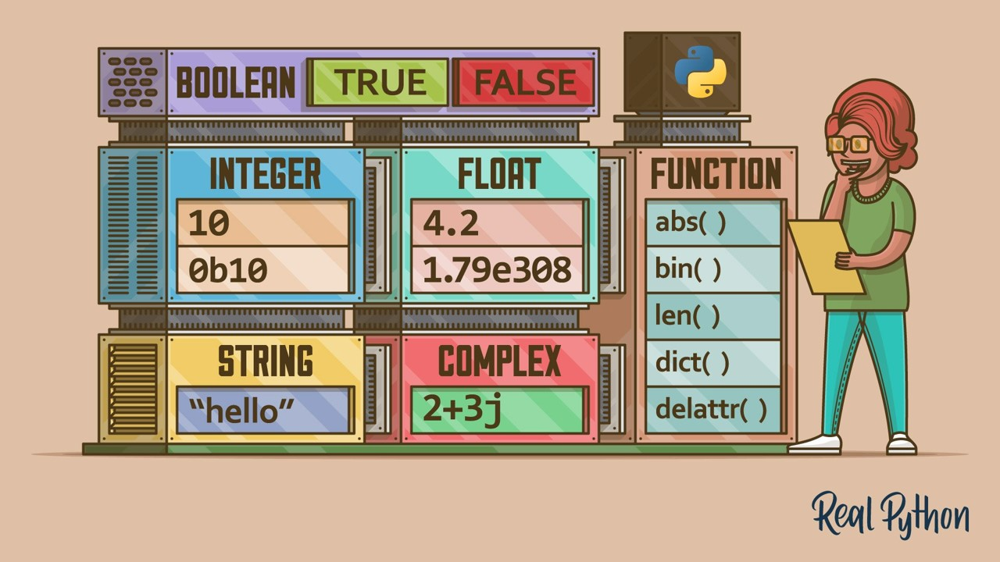
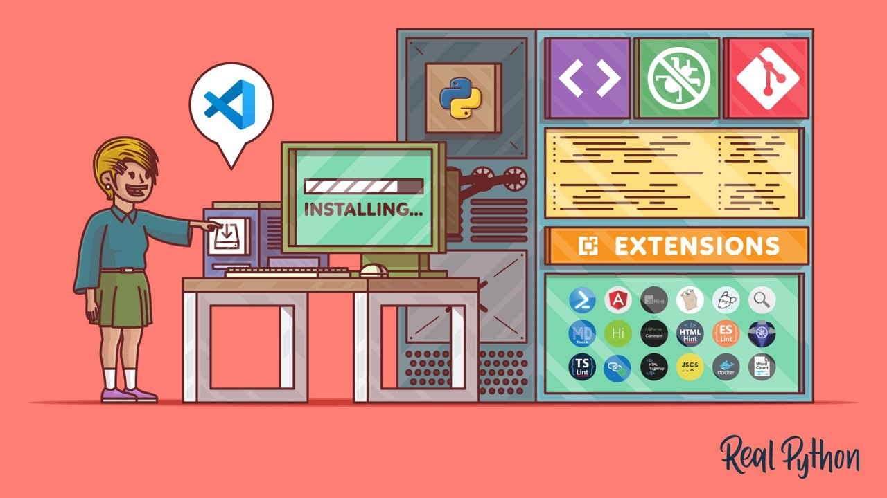
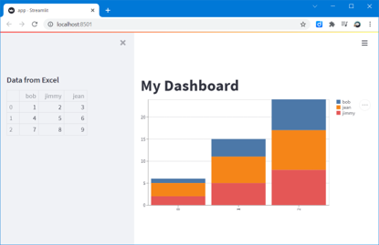

# Python Training

Learn Python for Data Analysis 

Why Python: Number 1 language according to [TIOBE index](https://www.tiobe.com/tiobe-index/) 


# 1. Get started with programming in Python
Download Python: https://www.python.org/ 

Agenda of [Python 101](doc/Python%20101.pptx):

| Chapter | | resources |
|---------|-|-----------|
|Datatypes| | https://realpython.com/python-data-types/ |
|Loops & Conditions | |https://realpython.com/python-for-loop/|
|Functions | |https://realpython.com/defining-your-own-python-function/ |
|Modules||https://realpython.com/python-modules-packages/ |
|VScode||https://realpython.com/python-development-visual-studio-code/ |
|Files management||https://realpython.com/working-with-files-in-python/ |

**Hands on + exercise!!!**

Open Terminal, and run python:
```python
>>> print("Hello World")
```

# 2. Discover the Scientific Python ecosystem

* [Numpy 101](doc/Numpy%20101.pptx)
* [Pandas 101](doc/Pandas%20101.pptx)
* [Automate Excel 101](doc/Automate%20Excel%20101.pptx)

Going further with Machine Learning:
* [Scikit-Learn 101](doc/Sklearn%20101.pptx)
* [Deep Learning 101](doc/Deep%20Learning%20101.pptx)

# 3. Develop web apps with Streamlit

Install via PIP (package manager for Python): `$ pip install streamlit`

Or if you cannot find pip:
`$ python3 -m pip install streamlit`

Develop your first [app.py](code/app.py):
```python
import streamlit as st
import pandas as pd

st.write("# My Dashboard")

df = pd.read_excel('data/data.xlsx')

st.sidebar.write("## Data from Excel")
st.sidebar.write(df)

st.bar_chart(df)
```



Read more: https://streamlit.io/

**Deploy with Streamlit Cloud**

[](https://python101.streamlit.app/)

# 4. Version your code with Git & GitHub

Learn the basics about source control with Git: 
* [GIT 101](doc/GIT%20101.pptx)

More resources:
- https://git-scm.com/
- https://realpython.com/advanced-git-for-pythonistas/

