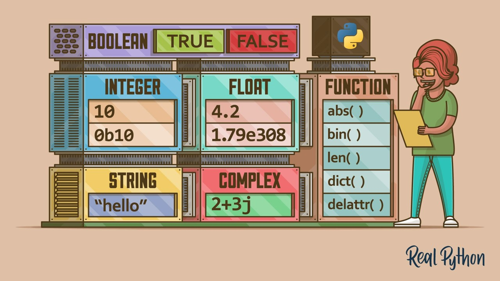
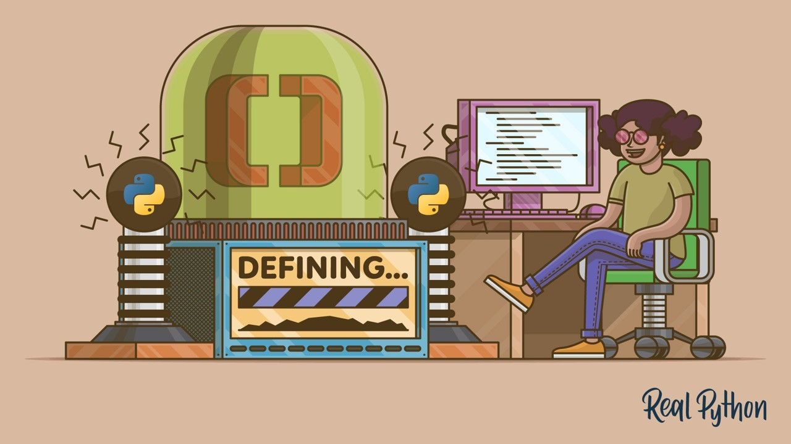
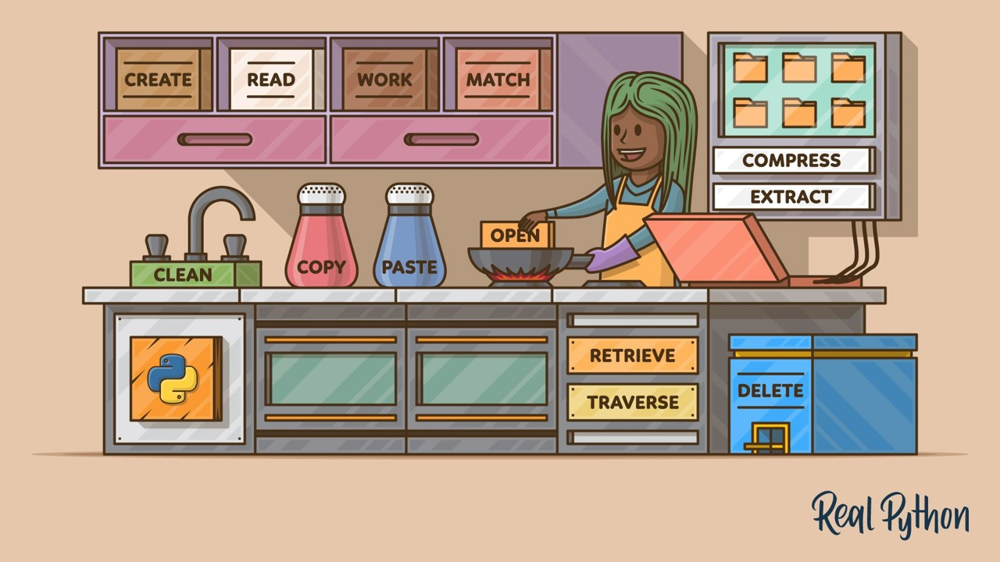
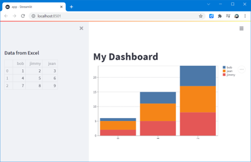

# Python Training
Learn Python, Numpy, Pandas, Scikit-Learn & Streamlit 


# 1. Get started with programming in Python
Download Python: https://www.python.org/ 

Why Python: Number 1 language according to [TIOBE index](https://www.tiobe.com/tiobe-index/) 

Agenda of [Python 101](doc/Python%20101.pptx):

| Chapter | | resources |
|---------|-|-----------|
|Datatypes| | https://realpython.com/python-data-types/ |
|Loops & Conditions | |https://realpython.com/python-for-loop/|
|Functions | |https://realpython.com/defining-your-own-python-function/ |
|Modules||https://realpython.com/python-modules-packages/ |
|VScode||https://realpython.com/python-development-visual-studio-code/ |
|Files management||https://realpython.com/working-with-files-in-python/ |

**Hands on + exercise!!!**

Open Terminal, and run python:
```python
>>> print("Hello World")
```

# 2. Discover the Scientific Python ecosystem

* [Numpy 101](doc/Numpy%20101.pptx)
* [Pandas 101](doc/Pandas%20101.pptx)
* [Scikit-Learn 101](doc/Sklearn%20101.pptx)

**Develop your first web app with Streamlit**

Install via PIP (package manager for Python): `$ pip install streamlit`

Or if you cannot find pip:
`$ python3 -m pip install streamlit`

Develop your first [app.py](code/app.py):
```python
import streamlit as st
st.write(“Hello World!”)
```



Read more: https://streamlit.io/

# 3.a. Deploy with Git & Heroku

Learn the basics about source control with Git: https://git-scm.com/


Heroku tutorial: https://devcenter.heroku.com/articles/getting-started-with-python
https://github.com/slevin48/streamlit

**Required files:**
1.	[setup.sh](code/setup.sh)
2.	[Procfile](code/Procfile)
3.	[requirements.txt](code/requirements.txt)


Additional tutorial: https://github.com/slevin48/streamlit

# 3.b. Deploy with GitHub & Streamlit Cloud

[](https://share.streamlit.io/slevin48/training/main/app.py)
